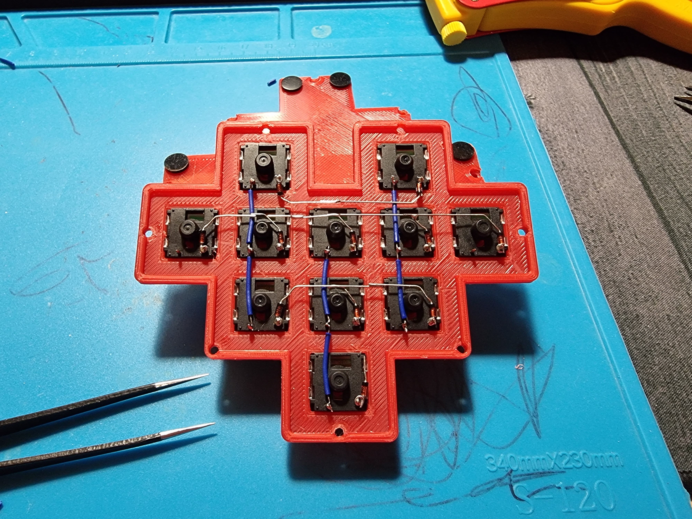

# Macro Valentine

---

## Parts

 * 11 low profile MX switches 
   [Kailh](https://www.aliexpress.com/item/4000803757746.html)
   [Gateron](https://www.aliexpress.com/item/1005003275437286.html)
 * [11 do-35 1N4148 High-speed switching diodes](https://www.aliexpress.com/item/32729204179.html)
 * [11 dsa keycaps](https://www.aliexpress.com/item/32830177884.html)
 * [Pro Micro with USB Type-C](https://www.aliexpress.com/item/32887074671.html)
 * Slick USB Type-C cable ( clearance is not too big ;) )
 * Some flexible wire for internal wiring
 * 7 M2 14mm screws

Hope I do not forget anything :) 

## My Build

